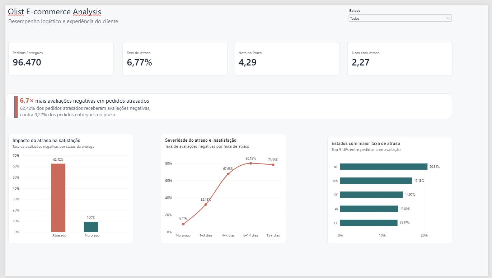

# Olist E-commerce Data Analysis

## Análise de desempenho logístico e experiência do cliente

Estudo de caso de análise de dados desenvolvido a partir do **Brazilian E-Commerce Public Dataset by Olist**, com foco na relação entre desempenho das entregas e satisfação dos clientes.

O projeto utiliza **SQL, Google BigQuery e Power BI** para percorrer as etapas de definição do problema, preparação, limpeza, análise, visualização e elaboração de recomendações orientadas por dados.

---

## Dashboard



### Principais indicadores

| Indicador | Resultado |
|---|---:|
| Pedidos entregues analisados | 96.470 |
| Taxa geral de atraso | 6,77% |
| Nota média — pedidos no prazo | 4,29 |
| Nota média — pedidos atrasados | 2,27 |
| Avaliações negativas — no prazo | 9,27% |
| Avaliações negativas — atrasados | 62,42% |

> **Principal insight:** pedidos atrasados apresentaram aproximadamente **6,7 vezes mais avaliações negativas** do que pedidos entregues no prazo.

---

## Problema de negócio

A experiência de compra em um marketplace pode ser influenciada por diferentes fatores operacionais, incluindo o cumprimento dos prazos de entrega.

Este estudo busca responder à seguinte pergunta:

> **Quais fatores estão associados a atrasos de entrega e avaliações negativas, e quais regiões, categorias de produtos ou vendedores concentram os principais pontos de atenção?**

A análise foi desenvolvida para apoiar decisões relacionadas a:

- desempenho logístico;
- satisfação do cliente;
- acompanhamento regional;
- desempenho de categorias;
- acompanhamento de vendedores;
- priorização de problemas operacionais.

---

## Fonte dos dados

Foi utilizado o **Brazilian E-Commerce Public Dataset by Olist**, disponibilizado publicamente no Kaggle.

O conjunto contém dados históricos anonimizados de um marketplace brasileiro, distribuídos em nove arquivos CSV relacionados.

Os registros abrangem principalmente o período entre **setembro de 2016 e outubro de 2018**.

**Fonte:** Olist — Brazilian E-Commerce Public Dataset  
**Plataforma:** Kaggle

https://www.kaggle.com/datasets/olistbr/brazilian-ecommerce

Por se tratar de uma base histórica, os resultados não representam necessariamente o desempenho atual da empresa ou do comércio eletrônico brasileiro.

---

## Metodologia

O estudo foi estruturado seguindo as seis etapas do processo de análise de dados utilizadas no Google Data Analytics Professional Certificate.

### 1. Ask

Definição da tarefa de negócio, perguntas analíticas, stakeholders e métricas relevantes.

[Ver documentação da etapa Ask](documentation/ask.md)

### 2. Prepare

Avaliação da origem, estrutura, relacionamentos, qualidade, credibilidade e limitações dos dados.

[Ver documentação da etapa Prepare](documentation/prepare.md)

### 3. Process

Validação da integridade dos dados, tratamento de avaliações múltiplas, análise de valores ausentes e criação das estruturas tratadas utilizadas na análise.

[Ver documentação da etapa Process](documentation/process.md)

### 4. Analyze

Análise da relação entre atrasos e satisfação, intensidade dos atrasos e diferenças por estado, categoria e vendedor.

[Ver documentação da etapa Analyze](documentation/analyze.md)

### 5. Share

Construção de um dashboard no Power BI para comunicar os principais indicadores e descobertas.

[Ver documentação da etapa Share](documentation/share.md)

### 6. Act

Elaboração de recomendações e identificação de possíveis próximos passos com base nos resultados encontrados.

[Ver documentação da etapa Act](documentation/act.md)

---

## Tecnologias utilizadas

| Tecnologia | Aplicação |
|---|---|
| Google BigQuery | Armazenamento, consulta e transformação dos dados |
| SQL | Validação, limpeza, integração e análise |
| Power BI | Criação de métricas e visualização dos resultados |
| GitHub | Versionamento, documentação e publicação do estudo de caso |

---

## Preparação e tratamento dos dados

As tabelas importadas no BigQuery foram mantidas separadas das estruturas utilizadas para análise.

Foram utilizados dois conjuntos principais:

`olist_raw`

Tabelas importadas a partir dos arquivos originais.

`olist_analytics`

Views tratadas utilizadas nas análises.

Duas estruturas principais foram criadas:

### `reviews_clean`

Mantém uma única avaliação por pedido.

Quando um pedido possuía mais de uma avaliação, foi priorizada a avaliação mais recente.

As notas também foram classificadas em:

- `negative`: notas 1 e 2;
- `neutral`: nota 3;
- `positive`: notas 4 e 5.

### `orders_clean`

Mantém apenas pedidos efetivamente entregues e com data de entrega válida.

Foram calculados:

- tempo de entrega;
- diferença entre entrega real e estimada;
- quantidade de dias de atraso;
- indicador de pedido atrasado.

Um pedido foi considerado atrasado quando a **data real de entrega foi posterior à data estimada**.

---

## Principais resultados

### 1. Atrasos estão fortemente associados à insatisfação

Pedidos entregues no prazo apresentaram:

- nota média de **4,29**;
- **9,27%** de avaliações negativas;
- **82,66%** de avaliações positivas.

Pedidos atrasados apresentaram:

- nota média de **2,27**;
- **62,42%** de avaliações negativas;
- **26,70%** de avaliações positivas.

A incidência de avaliações negativas foi aproximadamente **6,7 vezes maior** entre os pedidos atrasados.

---

### 2. A severidade do atraso está associada à piora da avaliação

| Faixa de atraso | Nota média | Avaliações negativas |
|---|---:|---:|
| No prazo | 4,29 | 9,27% |
| 1–3 dias | 3,29 | 32,13% |
| 4–7 dias | 2,10 | 67,68% |
| 8–14 dias | 1,67 | 80,15% |
| 15+ dias | 1,72 | 78,35% |

A deterioração da satisfação se torna especialmente forte a partir de quatro dias de atraso.

---

### 3. Existem diferenças importantes entre estados

Entre os pedidos com avaliação, os estados com maiores taxas de atraso foram:

| Estado | Taxa de atraso |
|---|---:|
| AL | 20,81% |
| MA | 17,13% |
| SE | 14,97% |
| PI | 13,80% |
| CE | 13,67% |

Entretanto, analisar somente percentuais pode gerar uma visão incompleta.

O Rio de Janeiro apresentou **1.456 pedidos atrasados**, com taxa de atraso de 11,92%.

São Paulo apresentou taxa menor, de **4,44%**, mas concentrou **1.786 atrasos** devido ao elevado volume de pedidos.

Por isso, taxa e volume devem ser avaliados em conjunto.

---

### 4. Algumas categorias concentram maior impacto operacional

Categorias de grande volume como:

- `cama_mesa_banho`;
- `beleza_saude`;
- `moveis_decoracao`;
- `informatica_acessorios`;

concentraram centenas de entregas atrasadas.

A categoria `moveis_escritorio` também chamou atenção pela combinação entre atraso e insatisfação, apresentando **21,95% de avaliações negativas**.

---

### 5. O atraso não explica toda a insatisfação

Algumas categorias e vendedores apresentaram taxas relevantes de avaliações negativas mesmo quando o desempenho de entrega não estava entre os piores.

Isso sugere que outros fatores podem influenciar a experiência do cliente, como:

- qualidade do produto;
- embalagem;
- comunicação;
- atendimento;
- divergência entre produto e descrição.

Essas possibilidades são hipóteses e não foram diretamente medidas neste estudo.

---

## Recomendações

Com base nos resultados encontrados, as principais recomendações são:

1. acompanhar continuamente a taxa de pedidos entregues após a data estimada;
2. monitorar separadamente atrasos mais severos;
3. combinar taxa de atraso e volume de pedidos na priorização regional;
4. acompanhar categorias com alto volume e grande quantidade de atrasos;
5. monitorar vendedores que combinam volume, atraso e avaliações negativas;
6. melhorar a comunicação com clientes quando houver risco de atraso;
7. investigar outros fatores associados às avaliações negativas.

As recomendações detalhadas estão disponíveis em:

[documentation/act.md](documentation/act.md)

---

## Consultas SQL

As consultas utilizadas no projeto estão organizadas na pasta `sql`.

### Qualidade dos dados

[`sql/data_quality.sql`](sql/data_quality.sql)

Contém consultas utilizadas para:

- verificar quantidade de registros;
- validar chaves;
- identificar valores ausentes;
- investigar avaliações múltiplas;
- validar as views tratadas.

### Limpeza e transformação

[`sql/data_cleaning.sql`](sql/data_cleaning.sql)

Contém as transformações utilizadas para criar:

- `reviews_clean`;
- `orders_clean`.

### Análise de negócio

[`sql/business_analysis.sql`](sql/business_analysis.sql)

Contém as consultas utilizadas nas análises de:

- atraso e satisfação;
- severidade do atraso;
- estados;
- categorias;
- vendedores.

---

## Estrutura do repositório

```text
olist-ecommerce-data-analysis/
│
├── assets/
│   └── dashboard-overview.png
│
├── documentation/
│   ├── ask.md
│   ├── prepare.md
│   ├── process.md
│   ├── analyze.md
│   ├── share.md
│   └── act.md
│
├── sql/
│   ├── data_quality.sql
│   ├── data_cleaning.sql
│   └── business_analysis.sql
│
└── README.md
```
Limitações

Algumas limitações devem ser consideradas:

o conjunto contém dados históricos;
associação entre atraso e avaliação não comprova causalidade;
algumas análises utilizam apenas pedidos com avaliação disponível;
pedidos podem conter múltiplas categorias;
a análise de vendedores foi restringida para reduzir problemas de atribuição em pedidos com múltiplos vendedores;
outras dimensões da experiência do cliente não foram diretamente analisadas.
Próximos passos

Possíveis extensões do estudo incluem:

análise de preço e frete;
análise textual dos comentários dos clientes;
análise temporal e sazonalidade;
investigação mais detalhada das causas de avaliações negativas;
desenvolvimento de uma metodologia para pedidos com múltiplos vendedores.
Sobre o projeto

Este estudo de caso foi desenvolvido como parte do Google Data Analytics Professional Certificate.

O objetivo foi aplicar o processo completo de análise de dados a um conjunto público, passando pela definição do problema de negócio, preparação e limpeza dos dados, análise em SQL, criação de visualizações no Power BI e elaboração de recomendações baseadas nos resultados.

O projeto foi desenvolvido para fins educacionais e de portfólio.
